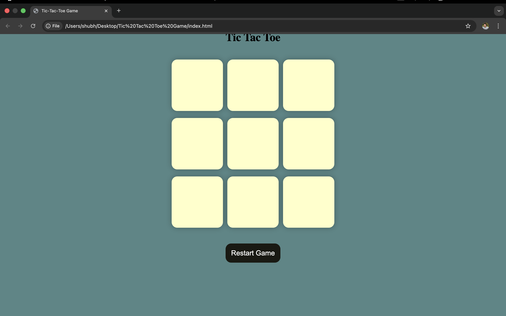

# Tic Tac Toe Game 🎮

A simple Tic Tac Toe game built using **HTML, CSS and JavaScript**.  
This project demonstrates basic **DOM manipulation, game logic, and event handling** in JavaScript.

---

## 🚀 Features
- Interactive Tic Tac Toe board  
- Two player mode (X vs O)  
- Win detection logic  
- Restart / New Game button  
- Clean and simple UI  

---

## 🛠️ Technologies Used
- HTML  
- CSS  
- JavaScript (DOM Manipulation)

---

## 📸 Screenshot

---

## 🎮 How to Play
1. Player **X** starts the game  
2. Players take turns clicking on the boxes  
3. First player to get **three marks in a row** wins  
4. Click **New Game / Restart** to start again

---

## 🌐 Live Demo
[Play the game here](https://abhishek-105.github.io/Tic-Tac-Toe-Game/)

---

## 👨‍💻 Author
**Abhishek Kumar**
